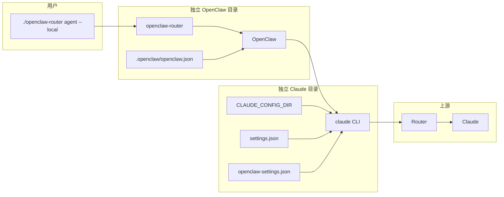
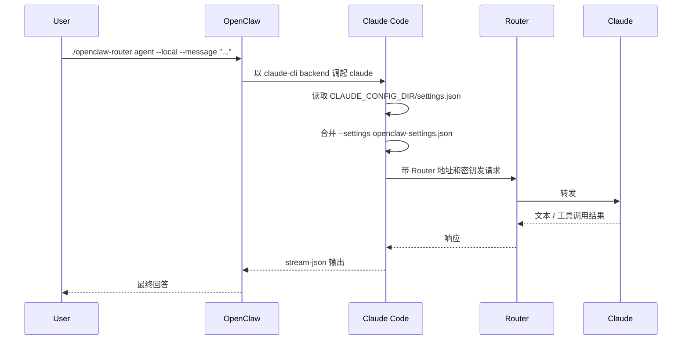
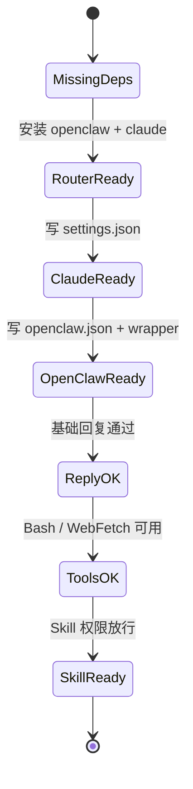
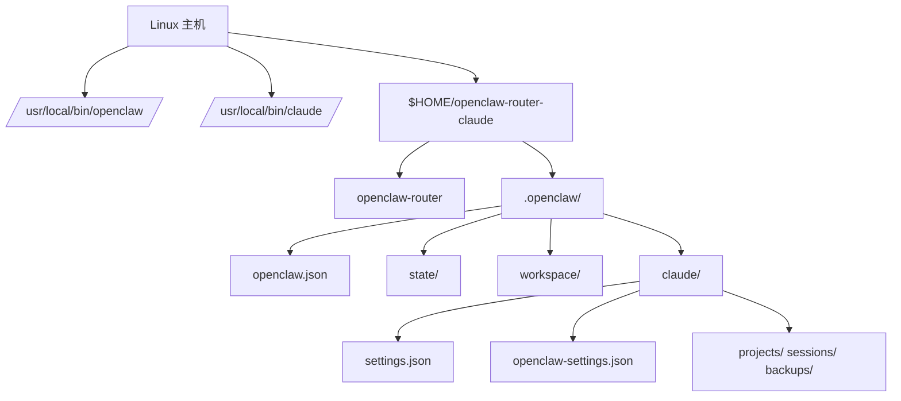

# OpenClaw 通过本地 Claude Code 接 Router Claude 最小手册

> 目标：在一个独立目录里，让 `OpenClaw` 不直连模型，而是调用本机 `claude`，再由 `claude` 走 Router 访问上游 Claude；同时保证 `Bash`、网络、`Skill` 可调用。

## 战报结论

- 最稳的链路是：`OpenClaw -> 本地 claude CLI -> Router -> Claude`
- 最值得复用的只有两样：系统里的 `openclaw` 二进制、系统里的 `claude` 二进制
- 最需要独立的有三样：OpenClaw 配置、OpenClaw 状态目录、Claude 会话目录
- Router 放在 `settings.json` 里配，工具权限放在 `openclaw-settings.json` 里配，职责清晰，最好排错

一句话理解：

```text
OpenClaw 只负责“发起调用”，Claude Code 负责“走 Router 并执行工具”
```

## 架构图

### 泳道图



### 序列图



### 状态图



### 部署图



## 目录与 4 个关键文件

建议目录结构：

```text
$OC_ROOT/
├── openclaw-router
└── .openclaw/
    ├── openclaw.json
    ├── state/
    ├── workspace/
    └── claude/
        ├── settings.json
        ├── openclaw-settings.json
        ├── projects/
        ├── sessions/
        └── backups/
```

4 个文件各干什么：

| 文件 | 作用 | 谁读取它 |
| --- | --- | --- |
| `openclaw-router` | 固定 `OPENCLAW_STATE_DIR` 与 `OPENCLAW_CONFIG_PATH` | Shell |
| `.openclaw/openclaw.json` | 告诉 OpenClaw 使用 `claude-cli` backend | OpenClaw |
| `.openclaw/claude/settings.json` | 配 Router 地址、密钥、Claude 运行环境 | Claude Code |
| `.openclaw/claude/openclaw-settings.json` | 给这套 OpenClaw 单独放行工具权限 | Claude Code |

关系只有一条：

```text
openclaw-router
  -> openclaw.json
     -> claude CLI
        -> CLAUDE_CONFIG_DIR=.openclaw/claude
           -> settings.json
        -> --settings openclaw-settings.json
```

这里最容易混淆的点：

- `settings.json` 是 Claude 的“主配置”，重点解决“连谁”
- `openclaw-settings.json` 是这次启动额外注入的“补充配置”，重点解决“能用什么工具”
- `CLAUDE_CONFIG_DIR` 决定 Claude 的项目日志、会话、缓存写到哪里，所以它就是“会话隔离开关”

## 从零搭建

### 1. 安装前检查

```bash
node -v || true
npm -v || true
openclaw --version || true
claude --version || true
```

如果缺 `node`：

```bash
curl -fsSL https://deb.nodesource.com/setup_22.x | bash -
apt-get install -y nodejs
```

如果缺 `openclaw` 或 `claude`：

```bash
npm i -g openclaw @anthropic-ai/claude-code
```

预期至少能看到：

```text
OpenClaw ...
2.x.x
```

### 2. 一次性创建独立目录和配置

默认放在 `$HOME/openclaw-router-claude`。如果你想放到当前目录，把下面第一行改成 `export OC_ROOT="$PWD/openclaw-router-claude"`。

先把这两个值改成你自己的：

- `ROUTER_BASE_URL`
- `ROUTER_API_KEY`

```bash
export OC_ROOT="$HOME/openclaw-router-claude"
export OC_BASE="$OC_ROOT/.openclaw"
export ROUTER_BASE_URL="https://router.example.com"
export ROUTER_API_KEY="sk-your-router-key"
export OC_GATEWAY_PORT=18840
export OC_GATEWAY_TOKEN="$(openssl rand -hex 24)"

mkdir -p "$OC_BASE/state" "$OC_BASE/workspace" "$OC_BASE/claude"

cat > "$OC_BASE/claude/settings.json" <<EOF
{
  "env": {
    "ANTHROPIC_AUTH_TOKEN": "$ROUTER_API_KEY",
    "ANTHROPIC_BASE_URL": "$ROUTER_BASE_URL",
    "CLAUDE_CODE_DISABLE_NONESSENTIAL_TRAFFIC": "1"
  },
  "permissions": {
    "allow": [],
    "deny": []
  }
}
EOF

cat > "$OC_BASE/claude/openclaw-settings.json" <<'EOF'
{
  "permissions": {
    "allow": [
      "Skill",
      "Task",
      "TodoWrite",
      "Read",
      "Glob",
      "Grep",
      "WebFetch",
      "WebSearch",
      "Bash(curl:*)",
      "Bash(wget:*)",
      "Bash(rg:*)",
      "Bash(find:*)",
      "Bash(ls:*)",
      "Bash(cat:*)",
      "Bash(head:*)",
      "Bash(tail:*)",
      "Bash(sed:*)",
      "Bash(awk:*)",
      "Bash(jq:*)",
      "Bash(date:*)",
      "Bash(env:*)",
      "Bash(printenv:*)",
      "Bash(which:*)",
      "Bash(python3:*)"
    ],
    "deny": []
  }
}
EOF

cat > "$OC_BASE/openclaw.json" <<EOF
{
  "meta": {
    "lastTouchedVersion": "2026.4.15"
  },
  "agents": {
    "defaults": {
      "workspace": "$OC_BASE/workspace",
      "model": {
        "primary": "claude-cli/claude-sonnet-4-6"
      },
      "timeoutSeconds": 1800,
      "compaction": {
        "mode": "safeguard"
      },
      "cliBackends": {
        "claude-cli": {
          "command": "claude",
          "args": [
            "-p",
            "--output-format",
            "stream-json",
            "--include-partial-messages",
            "--verbose",
            "--setting-sources",
            "user",
            "--settings",
            "$OC_BASE/claude/openclaw-settings.json",
            "--permission-mode",
            "dontAsk"
          ],
          "env": {
            "CLAUDE_CONFIG_DIR": "$OC_BASE/claude"
          }
        }
      }
    }
  },
  "gateway": {
    "port": $OC_GATEWAY_PORT,
    "mode": "local",
    "auth": {
      "mode": "token",
      "token": "$OC_GATEWAY_TOKEN"
    }
  }
}
EOF

cat > "$OC_ROOT/openclaw-router" <<'EOF'
#!/usr/bin/env bash
set -euo pipefail

ROOT_DIR="$(cd "$(dirname "${BASH_SOURCE[0]}")" && pwd)"
BASE_DIR="$ROOT_DIR/.openclaw"

export OPENCLAW_STATE_DIR="$BASE_DIR/state"
export OPENCLAW_CONFIG_PATH="$BASE_DIR/openclaw.json"

exec openclaw "$@"
EOF

chmod +x "$OC_ROOT/openclaw-router"
```

这一步做完后，最关键的 4 个配置点已经齐了：

- `CLAUDE_CONFIG_DIR="$OC_BASE/claude"`：Claude 会话与全局环境隔离
- `settings.json`：Router 地址与密钥
- `--settings openclaw-settings.json`：专门给 OpenClaw 注入工具权限
- `--permission-mode dontAsk`：避免自动化调用时卡在人工批准

### 3. 先单独验证 Claude 是否能走 Router

这一步不通过，就先别碰 OpenClaw。

```bash
CLAUDE_CONFIG_DIR="$OC_BASE/claude" \
claude -p --model sonnet --permission-mode dontAsk 'Reply with ROUTER_OK only.'
```

预期输出：

```text
ROUTER_OK
```

常见报错：

- `401` / `403`：密钥不对
- `404`：`ANTHROPIC_BASE_URL` 路径不对，很多 Router 需要你补 `/v1`
- `ENOTFOUND` / `ECONNREFUSED`：域名或端口不通

回滚点：

- 只改 `.openclaw/claude/settings.json`
- 还不用碰 OpenClaw 任何文件

### 4. 再验证 OpenClaw 基础链路

先做配置校验：

```bash
cd "$OC_ROOT"
./openclaw-router config validate
```

预期输出：

```text
Config valid: ...
```

再做最小回复测试：

```bash
cd "$OC_ROOT"
timeout 60 ./openclaw-router agent --local \
  --session-id smoke \
  --message 'Reply with OPENCLAW_READY only.'
```

预期输出：

```text
OPENCLAW_READY
```

回滚点：

- 如果 `claude -p` 是通的，但这里不通，优先只查 `.openclaw/openclaw.json`
- 特别检查 `command`、`CLAUDE_CONFIG_DIR`、`--settings` 三处

### 5. 验证工具、网络、Skill

先测网络与 Bash：

```bash
cd "$OC_ROOT"
timeout 120 ./openclaw-router agent --local \
  --session-id weather \
  --message '今天杭州天气怎么样'
```

预期结果：

- 能返回天气内容
- 不应再出现 “don't ask 模式阻止 Bash / web_fetch” 这类提示

再测 Skill 通道是否已打通：

```bash
cd "$OC_ROOT"
timeout 120 ./openclaw-router agent --local \
  --session-id skill-smoke \
  --message '如果当前环境有可用 skill，优先用 skill 处理；否则用可用工具完成任务，并说明你用了什么。'
```

查 Claude 本地项目日志里的证据：

```bash
rg -n '"name":"Skill"|WebFetch|Bash' "$OC_BASE/claude/projects"
```

如何理解这个结果：

- 能看到 `Bash` 或 `WebFetch`，说明工具放行成功
- 能看到 `"name":"Skill"`，说明 Skill 也实际被调用了
- 如果没有 `"name":"Skill"`，但任务正常完成且没有权限拦截，通常说明“Skill 权限已打通，但当前环境没有命中合适 skill”

## 如果你已经有可用的 Claude Router 配置

如果你机器上已经有能跑通的：

```text
~/.claude/settings.json
```

可以直接复用它，只保留本地独立会话目录：

```bash
rm -f "$OC_BASE/claude/settings.json"
ln -snf "$HOME/.claude/settings.json" "$OC_BASE/claude/settings.json"
```

这样做的效果是：

- 复用现有 Router 地址和密钥
- 当前 OpenClaw 这套实例仍然使用独立的 `CLAUDE_CONFIG_DIR`
- 其它 OpenClaw 或 Claude 目录不会被污染

## 常见坑

### 1. 你在 `root` 下用了 `--dangerously-skip-permissions`

很多环境会直接拒绝。这里统一改用：

```text
--permission-mode dontAsk
```

### 2. OpenClaw 能回字，但工具一直被拦

优先检查这三件事：

1. `openclaw.json` 里是否真的带了 `--settings $OC_BASE/claude/openclaw-settings.json`
2. `openclaw-settings.json` 是否是合法 JSON
3. 你允许的工具名是否写对了，例如 `WebFetch`、`Skill`、`Bash(curl:*)`

### 3. 回答已经出来了，但命令不退出

有些环境下 `agent --local` 会拖住。测试时直接包一层：

```bash
timeout 60 ./openclaw-router agent --local ...
```

## 最小回滚

如果你只是想撤掉这套独立实例：

```bash
rm -rf "$HOME/openclaw-router-claude"
```

它不会影响：

- 系统安装的 `openclaw`
- 系统安装的 `claude`
- 你其它目录下的 OpenClaw
- 你全局的 `~/.claude/settings.json`

## 最小验收清单

- `claude -p ...` 单独走 Router 能输出 `ROUTER_OK`
- `./openclaw-router config validate` 通过
- `./openclaw-router agent --local ... OPENCLAW_READY` 成功
- 天气查询能返回结果，而不是卡在权限提示
- `rg -n '"name":"Skill"|WebFetch|Bash' "$OC_BASE/claude/projects"` 至少能查到工具调用痕迹

做到这几条，就说明你已经把这条链路跑通了：

```text
OpenClaw -> 本地 Claude Code -> Router -> Claude
```
