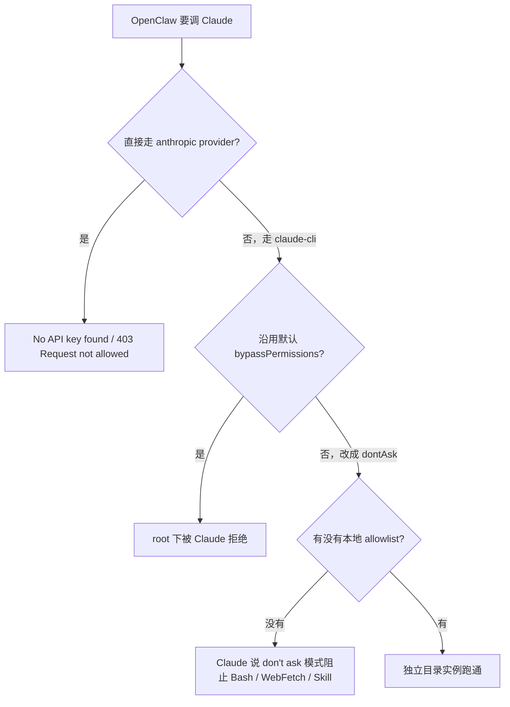

# OpenClaw 调 Router Claude 全链路实战手册（独立目录 / 工具放行 / Skill 可用）

> 这次不是“再装一套 OpenClaw”，而是“借现成的船，开一艘新的试验艇”。
>
> 复用已经安装好的 `openclaw` 与 `claude`，复用已经打通的 Router Claude 配置；
> 但把 OpenClaw 的 state、workspace、Claude 会话、工具权限全部切到独立目录。
>
> 这样做的好处很直接：
> 1. 动作小，不碰生产实例。
> 2. 回滚快，删一个目录就能撤。
> 3. 关键链路清楚，出了问题很容易定位到底是 OpenClaw、Claude、Router 还是权限策略。

## 0. 战报结论

- 已跑通：`/root/Codex/Openclaw` 下的独立目录 OpenClaw，能够成功调用 Router 上的 Claude。
- 已验证：`openclaw` 本体和 `claude` 本体都直接复用系统全局安装，不需要重复安装。
- 已验证：Router Claude 的认证和出口继续复用 `/root/.claude/settings.json`，没有把密钥再复制一份到测试目录。
- 已验证：OpenClaw 自己的状态目录、workspace、Claude 会话目录、权限配置都是独立的。
- 已验证：普通回答能跑通，天气查询能跑通，`Bash` / `WebFetch` / `WebSearch` / `Skill` 工具链路能跑通。
- 已找到并绕开两个关键坑：
  - OpenClaw 直连 `anthropic` provider 到 Router，这条路在本机实测会撞上 `403 Request not allowed`。
  - OpenClaw 默认 `claude-cli` backend 在 `root` 下会带出 `bypassPermissions`，从而触发 `--dangerously-skip-permissions cannot be used with root/sudo privileges`。
- 最终稳定路径：
  - OpenClaw 走 `claude-cli`
  - `claude-cli` 走 `/root/.claude/settings.json`
  - 单独指定 `CLAUDE_CONFIG_DIR`
  - 单独注入本地 `openclaw-settings.json` 放开工具白名单

## 1. 执行路线总览

1. 先确认机器母体环境已经具备：`openclaw`、`claude`、`node`、全局 Claude router 配置都在。
2. 在独立目录 `/root/Codex/Openclaw` 下创建一套测试实例目录：`.openclaw-test/`。
3. 用软链接复用 `/root/.claude/settings.json`，只复用 Router 配置，不复用 Claude 会话。
4. 给这套测试实例单独写一个 `openclaw-settings.json`，只负责工具权限放行。
5. 给 OpenClaw 单独写一个 `openclaw.json`，把模型后端切到 `claude-cli`，并把 `permission-mode` 改成 `dontAsk`。
6. 写一个 wrapper 脚本 `./openclaw-test`，统一注入 `OPENCLAW_STATE_DIR` 和 `OPENCLAW_CONFIG_PATH`。
7. 用 smoke test 先验证“能回复”，再验证“能联网”，最后验证“Skill 确实被调用过”。
8. 长期运行建议走 `gateway`，因为本机实测 `agent --local` 在输出结果后偶尔会有子进程收尾不够干净。

## 2. 架构图

```mermaid
flowchart LR
    U[用户执行 ./openclaw-test] --> W[wrapper 脚本]
    W --> O[OpenClaw CLI]
    O --> C[claude-cli backend]
    C --> R[Router: https://router.yeying.pub]
    R --> M[Claude Sonnet 4.6]

    O --> S[/root/Codex/Openclaw/.openclaw-test/state/]
    O --> WS[/root/Codex/Openclaw/.openclaw-test/workspace/]
    C --> CD[/root/Codex/Openclaw/.openclaw-test/claude/]

    CD --> L[settings.json 软链接]
    L --> GS[/root/.claude/settings.json]

    CD --> LS[/root/Codex/Openclaw/.openclaw-test/claude/openclaw-settings.json]
```

## 3. 路径与目录结构

### 3.1 复用什么

| 路径 | 角色 | 为什么复用 |
| --- | --- | --- |
| `/usr/local/bin/openclaw` | OpenClaw 可执行文件 | 已安装且可用，没必要再装一份 |
| `/usr/local/bin/claude` | Claude Code 可执行文件 | 已安装且已经能跑 Router Claude |
| `/root/.claude/settings.json` | 全局 Claude Router 配置 | 里面已经有 `ANTHROPIC_AUTH_TOKEN` 与 `ANTHROPIC_BASE_URL` |

### 3.2 隔离什么

| 路径 | 角色 | 为什么必须独立 |
| --- | --- | --- |
| `/root/Codex/Openclaw/.openclaw-test/state/` | OpenClaw state | 避免污染其它 profile / state |
| `/root/Codex/Openclaw/.openclaw-test/workspace/` | OpenClaw workspace | 让会话上下文、模板和工作区独立 |
| `/root/Codex/Openclaw/.openclaw-test/claude/` | Claude 本地 home | 让 Claude 的 sessions / projects / backups 独立 |
| `/root/Codex/Openclaw/.openclaw-test/claude/openclaw-settings.json` | 本实例的工具权限策略 | 不动全局权限策略 |

### 3.3 最终目录结构

```text
/root/Codex/Openclaw
├── openclaw-test
└── .openclaw-test
    ├── openclaw.json
    ├── state/
    ├── workspace/
    └── claude/
        ├── settings.json -> /root/.claude/settings.json
        ├── openclaw-settings.json
        ├── projects/
        ├── sessions/
        └── backups/
```

## 4. 实战步骤

### 步骤 0：先做母体环境自检

先确认你不是站在一块空地上施工。

```bash
printf 'openclaw: '; openclaw --version
printf 'claude: '; claude --version
printf 'node: '; node -v
printf 'openclaw path: '; which openclaw
printf 'claude path: '; which claude

test -f /root/.claude/settings.json && echo "global claude settings: OK"

sed -n '1,20p' /root/.claude/settings.json | \
  sed -E 's/(ANTHROPIC_AUTH_TOKEN": ").*(")/\1***REDACTED***\2/'

ss -lntp | rg ':(18801|18802|18830|18832|18833)\b' || true
ss -lntp | rg ':18840\b' || true
```

预期输出：

```text
openclaw: OpenClaw 2026.4.15 (041266a)
claude: 2.1.116 (Claude Code)
node: v22.22.0
openclaw path: /usr/local/bin/openclaw
claude path: /usr/local/bin/claude
global claude settings: OK
```

常见报错：

| 报错 | 说明 | 处理 |
| --- | --- | --- |
| `global claude settings: OK` 没出现 | 全局 Claude Router 还没配置 | 先把 `/root/.claude/settings.json` 配好 |
| `openclaw: command not found` | 机器还没装 OpenClaw | 先安装 OpenClaw |
| `claude: command not found` | 机器还没装 Claude Code | 先安装 Claude Code |
| `:18840` 已被监听 | 端口撞车 | 换一个没占用的端口 |

回滚点：

- 这一步只读，无需回滚。

---

### 步骤 1：定义独立实例的变量与目录

```bash
export OC_ROOT=/root/Codex/Openclaw
export OC_BASE=$OC_ROOT/.openclaw-test
export OC_GATEWAY_PORT=18840
export OC_GATEWAY_TOKEN="$(openssl rand -hex 24)"

mkdir -p "$OC_BASE"/state
mkdir -p "$OC_BASE"/claude
mkdir -p "$OC_BASE"/workspace
```

预期输出：

- 没有输出也正常。

常见报错：

| 报错 | 说明 | 处理 |
| --- | --- | --- |
| `Permission denied` | 当前用户没权限写目录 | 用有权限的用户执行，或确认目录属主 |

回滚点：

```bash
rm -rf /root/Codex/Openclaw/.openclaw-test
```

---

### 步骤 2：只复用全局 Claude Router 配置，不复用会话

核心动作是这一句软链接：

```bash
ln -snf /root/.claude/settings.json "$OC_BASE/claude/settings.json"
readlink -f "$OC_BASE/claude/settings.json"
```

预期输出：

```text
/root/.claude/settings.json
```

为什么这样做：

- 我们要复用的是“Router 接法”和“认证配置”。
- 我们不想复用的是“Claude 的项目会话、缓存、backups、session-env”。
- 所以最稳的做法不是复制整个 `~/.claude`，而是只把 `settings.json` 软链接进新的 `CLAUDE_CONFIG_DIR`。

常见报错：

| 报错 | 说明 | 处理 |
| --- | --- | --- |
| `No such file or directory: /root/.claude/settings.json` | 全局 Claude 设置不存在 | 先把全局 Claude router 配好 |

回滚点：

```bash
rm -f /root/Codex/Openclaw/.openclaw-test/claude/settings.json
```

---

### 步骤 3：给当前实例单独写工具权限文件

> 这里是这次成败的关键之一。
>
> 全局 `/root/.claude/settings.json` 里的 `permissions.allow` 是空的。
> 如果不补一份本地 allowlist，Claude 在 `dontAsk` 模式下会说：
> “系统处于 don't ask 模式，阻止了我使用 Bash 工具和 web_fetch 工具。”

执行：

```bash
cat > "$OC_BASE/claude/openclaw-settings.json" <<'EOF'
{
  "permissions": {
    "allow": [
      "Skill",
      "Task",
      "TodoWrite",
      "Read",
      "Glob",
      "Grep",
      "WebFetch",
      "WebSearch",
      "Bash(curl:*)",
      "Bash(wget:*)",
      "Bash(rg:*)",
      "Bash(find:*)",
      "Bash(ls:*)",
      "Bash(cat:*)",
      "Bash(head:*)",
      "Bash(tail:*)",
      "Bash(sed:*)",
      "Bash(awk:*)",
      "Bash(jq:*)",
      "Bash(date:*)",
      "Bash(env:*)",
      "Bash(printenv:*)",
      "Bash(which:*)",
      "Bash(python3:*)"
    ],
    "deny": []
  }
}
EOF
```

预期输出：

- 没有输出也正常。

这份文件的含义：

| 项目 | 作用 |
| --- | --- |
| `Skill` | 允许 Claude 显式调用 skill |
| `WebFetch` / `WebSearch` | 允许联网抓取与搜索 |
| `Bash(curl:*)` 等 | 允许常见只读查询命令，不直接放大到 `Bash(*)` |
| `Task` / `TodoWrite` | 允许常见任务编排与 todo 工具 |

常见报错：

| 报错 | 说明 | 处理 |
| --- | --- | --- |
| Claude 仍提示 “阻止使用 Bash / web_fetch” | 说明这个文件没被实际加载 | 检查后面的 `--settings` 参数是否配置进了 OpenClaw backend args |
| JSON 解析失败 | 文件格式写坏了 | 重新核对逗号和引号 |

回滚点：

```bash
rm -f /root/Codex/Openclaw/.openclaw-test/claude/openclaw-settings.json
```

---

### 步骤 4：写 OpenClaw 本地配置，强制走 `claude-cli`

先说结论：不要在这里走 OpenClaw 直连 `anthropic` provider。

本机实测这条路会撞到两类问题：

- `No API key found for provider "anthropic"`
- `HTTP 403 forbidden: Request not allowed`

最终稳定方案是：OpenClaw 只负责 orchestration，真正出网交给已经打通 Router 的 `claude` CLI。

执行：

```bash
cat > "$OC_BASE/openclaw.json" <<EOF
{
  "meta": {
    "lastTouchedVersion": "2026.4.15"
  },
  "agents": {
    "defaults": {
      "workspace": "/root/Codex/Openclaw/.openclaw-test/workspace",
      "model": {
        "primary": "claude-cli/claude-sonnet-4-6"
      },
      "timeoutSeconds": 1800,
      "compaction": {
        "mode": "safeguard"
      },
      "cliBackends": {
        "claude-cli": {
          "command": "claude",
          "args": [
            "-p",
            "--output-format",
            "stream-json",
            "--include-partial-messages",
            "--verbose",
            "--setting-sources",
            "user",
            "--settings",
            "/root/Codex/Openclaw/.openclaw-test/claude/openclaw-settings.json",
            "--permission-mode",
            "dontAsk"
          ],
          "env": {
            "CLAUDE_CONFIG_DIR": "/root/Codex/Openclaw/.openclaw-test/claude"
          }
        }
      }
    }
  },
  "gateway": {
    "port": ${OC_GATEWAY_PORT},
    "mode": "local",
    "auth": {
      "mode": "token",
      "token": "${OC_GATEWAY_TOKEN}"
    }
  }
}
EOF
```

参数说明：

| 参数 | 位置 | 推荐值 | 作用 | 如果不这么做 |
| --- | --- | --- | --- | --- |
| `model.primary` | `agents.defaults` | `claude-cli/claude-sonnet-4-6` | 强制 OpenClaw 走 Claude CLI | 继续走其它 provider，链路不稳定 |
| `command` | `cliBackends.claude-cli` | `claude` | 指定真正调用的二进制 | 缺失时会校验失败 |
| `--setting-sources user` | `args` | 固定 | 只加载 user 级设置 | 容易把其它来源混进来 |
| `--settings ...openclaw-settings.json` | `args` | 固定 | 加载当前实例的本地权限 allowlist | 工具可能继续被挡住 |
| `--permission-mode dontAsk` | `args` | 固定 | 在 root 环境下安全替代 `bypassPermissions` | 否则会触发 `--dangerously-skip-permissions ...` 报错 |
| `CLAUDE_CONFIG_DIR` | `env` | 本地独立目录 | 隔离 Claude 会话、projects、backups | Claude 会话会掉回全局目录 |
| `gateway.port` | `gateway` | `18840` | 给测试实例单独端口 | 和其它实例冲突 |
| `gateway.auth.token` | `gateway` | 随机生成 | 给本地 gateway 单独 token | 直接复用别人的 token 风险高 |

常见报错：

| 报错 | 说明 | 处理 |
| --- | --- | --- |
| `Config validation failed: agents.defaults.cliBackends.claude-cli.command` | 漏了 `command: "claude"` | 把 `command` 补上 |
| `--dangerously-skip-permissions cannot be used with root/sudo privileges` | 还在用默认 `bypassPermissions` | 改成 `dontAsk` |
| `HTTP 403 forbidden: Request not allowed` | 你走的是 direct anthropic provider 路线，不是 claude-cli reuse 路线 | 切回本文方案 |

回滚点：

```bash
rm -f /root/Codex/Openclaw/.openclaw-test/openclaw.json
```

---

### 步骤 5：写 wrapper 脚本，固定入口

执行：

```bash
cat > "$OC_ROOT/openclaw-test" <<'EOF'
#!/usr/bin/env bash
set -euo pipefail

ROOT_DIR="$(cd "$(dirname "${BASH_SOURCE[0]}")" && pwd)"
BASE_DIR="$ROOT_DIR/.openclaw-test"
STATE_DIR="$BASE_DIR/state"
CONFIG_PATH="$BASE_DIR/openclaw.json"
CLAUDE_DIR="$BASE_DIR/claude"
SOURCE_SETTINGS="/root/.claude/settings.json"
SETTINGS_LINK="$CLAUDE_DIR/settings.json"

mkdir -p "$STATE_DIR" "$CLAUDE_DIR"

if [ ! -f "$SOURCE_SETTINGS" ]; then
  echo "Missing Claude settings: $SOURCE_SETTINGS" >&2
  exit 1
fi

if [ ! -e "$SETTINGS_LINK" ]; then
  ln -s "$SOURCE_SETTINGS" "$SETTINGS_LINK"
fi

export OPENCLAW_STATE_DIR="$STATE_DIR"
export OPENCLAW_CONFIG_PATH="$CONFIG_PATH"

exec openclaw "$@"
EOF

chmod +x "$OC_ROOT/openclaw-test"
```

为什么要 wrapper：

- 你以后只需要记住一个入口：`./openclaw-test ...`
- 不需要每次手工 export `OPENCLAW_STATE_DIR` / `OPENCLAW_CONFIG_PATH`
- 不会手滑把命令打到别的 OpenClaw profile

预期输出：

- 没有输出也正常。

常见报错：

| 报错 | 说明 | 处理 |
| --- | --- | --- |
| `Missing Claude settings: /root/.claude/settings.json` | 全局 Claude router 配置丢了 | 先把全局配置补回来 |

回滚点：

```bash
rm -f /root/Codex/Openclaw/openclaw-test
```

---

### 步骤 6：验证配置是否可加载

```bash
cd /root/Codex/Openclaw
./openclaw-test config validate
```

预期输出：

```text
Config valid: ~/Codex/Openclaw/.openclaw-test/openclaw.json
```

常见报错：

| 报错 | 说明 | 处理 |
| --- | --- | --- |
| `Config validation failed` | `openclaw.json` 语法或字段有误 | 回到步骤 4 对照修正 |

回滚点：

- 这一步只验证，不写新状态。

---

### 步骤 7：最小 smoke test，先确认“能回复”

为避免本机 `agent --local` 收尾偶尔不利落，建议 smoke test 外面包一个 `timeout`。

```bash
cd /root/Codex/Openclaw
timeout 60 ./openclaw-test agent --local \
  --session-id smoke \
  --message 'Reply with OPENCLAW_TEST_READY only.'
```

预期输出：

```text
[agent/cli-backend] cli exec: provider=claude-cli model=sonnet promptChars=...
OPENCLAW_TEST_READY
```

常见报错：

| 报错 | 说明 | 处理 |
| --- | --- | --- |
| `--dangerously-skip-permissions cannot be used with root/sudo privileges` | 没切到 `dontAsk` | 回到步骤 4 |
| `No API key found for provider "anthropic"` | 你走回 direct provider 了 | 保持本文的 `claude-cli` 路径 |
| `Missing Claude settings` | 全局 Claude settings 不存在 | 先修全局配置 |

回滚点：

- 这一步只会在本地独立目录下产生会话文件，不会影响其它 OpenClaw。

---

### 步骤 8：验证工具、网络、Skill 都能正常用

#### 8.1 网络与工具验证：天气查询

```bash
cd /root/Codex/Openclaw
timeout 60 ./openclaw-test agent --local \
  --session-id weather-check \
  --message '今天杭州天气怎么样'
```

预期输出：

天气是动态数据，具体数值会变，但应该能看到一段类似下面的结果：

```text
[agent/cli-backend] cli exec: provider=claude-cli model=sonnet promptChars=9
今天杭州的天气：

🌦 小雨
- 温度：...
- 风向风速：...
- 湿度：...
```

如果仍然提示：

```text
系统处于 "don't ask" 模式，阻止了我使用 Bash 工具和 web_fetch 工具
```

说明本地 `openclaw-settings.json` 没有被真正加载，请回查：

- `openclaw.json` 里是否包含 `--settings /root/Codex/Openclaw/.openclaw-test/claude/openclaw-settings.json`
- `openclaw-settings.json` 是否存在且 JSON 正确

#### 8.2 Skill 硬证据验证：直接在 Claude 项目日志里查

天气查询本身就已经出现过真实 `Skill` 调用记录。可以直接查本地 Claude 项目日志：

```bash
rg -n '"name":"Skill"|mcp__openclaw__web_fetch|"name":"Bash"' \
  /root/Codex/Openclaw/.openclaw-test/claude/projects
```

预期输出会命中类似记录：

```text
... "name":"Skill","input":{"args":"杭州","skill":"openclaw-skills:weather"} ...
... "name":"mcp__openclaw__web_fetch" ...
... "name":"Bash","input":{"command":"curl -s \"wttr.in/Hangzhou?..."} ...
```

这说明三件事都发生过：

- `Skill` 工具确实被调用过
- Web 抓取链路确实被调用过
- Bash 查询命令确实被允许并实际执行过

#### 8.3 再做一次显式 Skill 验证

```bash
cd /root/Codex/Openclaw
timeout 60 ./openclaw-test agent --local \
  --session-id skill-check \
  --message '如果我要给 Claude 增加允许的工具，应该改哪个配置文件？请先显式调用一个合适的 skill，再用两句话回答。'
```

在本机实测中，这条会在本地 Claude 项目日志中留下类似记录：

```text
"name":"Skill","input":{"skill":"update-config","args":"如何给 Claude 增加允许的工具权限"}
```

如果你只看终端输出，Claude 可能直接给出答案而不把 tool trace 打在屏幕上，这很正常。要看硬证据，去查上面的 `projects/*.jsonl`。

回滚点：

- 这一步只会在 `/root/Codex/Openclaw/.openclaw-test/claude/projects/` 下多几份本地会话日志。

---

### 步骤 9：长期运行建议切 `gateway`

`agent --local` 适合做单次 smoke test。

本机实测有一个已知现象：

- 结果已经正确打印出来
- 但 OpenClaw 本地 agent 子进程偶尔收尾不够干净

所以长期用法建议切成 `gateway`。

前台启动：

```bash
cd /root/Codex/Openclaw
./openclaw-test gateway
```

另开一个终端做健康检查：

```bash
cd /root/Codex/Openclaw
./openclaw-test health
```

预期输出：

- `gateway` 终端会显示网关启动日志
- `health` 应返回健康状态信息

如果要后台化，可以这样：

```bash
cd /root/Codex/Openclaw
nohup ./openclaw-test gateway > ./.openclaw-test/state/gateway.log 2>&1 &
echo $! > ./.openclaw-test/state/gateway.pid
```

停止：

```bash
kill "$(cat /root/Codex/Openclaw/.openclaw-test/state/gateway.pid)"
```

## 5. 为什么这条路线能成

### 5.1 失败路线图



### 5.2 为什么不建议 OpenClaw 直连 `anthropic` provider

这一步最容易让人走错，因为“看起来更直接”。

但在本机环境里，实际已经验证出两个问题：

1. OpenClaw 直连 `anthropic` provider 时，会先从自己的 auth store 找凭据，而不是自然继承你在 `/root/.claude/settings.json` 里那套已经跑通的 Router Claude 配置。
2. 就算把环境变量喂进去，这条 direct path 仍然实测返回过 `HTTP 403 forbidden: Request not allowed`。

结论：

- 理论上更直的路，在这台机器上反而更不稳。
- 复用已经跑通的 `claude` CLI，才是低风险路线。

### 5.3 为什么 `root` 下必须从 `bypassPermissions` 改成 `dontAsk`

OpenClaw 内置的 `claude-cli` backend 默认思路是：

- 为了少打断执行，尽量用跳过权限的方式运行

但在 `root` 环境里，Claude Code 明确会拒绝这种模式，并报：

```text
--dangerously-skip-permissions cannot be used with root/sudo privileges
```

所以这里必须改成：

- `--permission-mode dontAsk`

这不是“偷懒参数”，而是“root 环境兼容参数”。

### 5.4 为什么 `CLAUDE_CONFIG_DIR` 是整个方案的隔离阀门

`CLAUDE_CONFIG_DIR` 一改，Claude 的这些东西都会转入本地独立目录：

- `projects/`
- `sessions/`
- `backups/`
- `.claude.json`
- `session-env/`

然后再把 `settings.json` 单独软链接回 `/root/.claude/settings.json`，就实现了：

- 认证与 Router 配置复用
- 会话与缓存隔离

这一步是整套方案最漂亮的地方。

### 5.5 为什么还要再补一个 `openclaw-settings.json`

因为我们不想动全局 `/root/.claude/settings.json`。

全局文件负责的是：

- Router 地址
- Claude token
- 全局基础权限策略

本地补充文件负责的是：

- 当前测试实例需要的工具 allowlist

两者职责分离之后，测试实例的权限放大不会波及其它 Claude 会话。

## 6. 常见报错速查表

| 现象 / 报错 | 根因 | 处理 |
| --- | --- | --- |
| `No API key found for provider "anthropic"` | 你走了 OpenClaw direct anthropic provider | 切回 `claude-cli` 路线 |
| `HTTP 403 forbidden: Request not allowed` | direct anthropic provider 与当前 router 的协议约定不匹配 | 切回 `claude-cli` 路线 |
| `--dangerously-skip-permissions cannot be used with root/sudo privileges` | 还在用默认跳过权限模式 | 改成 `--permission-mode dontAsk` |
| `系统处于 "don't ask" 模式，阻止了我使用 Bash 工具和 web_fetch 工具` | 本地 allowlist 没有加载成功 | 检查 `--settings` 与 `openclaw-settings.json` |
| `Config validation failed: ...command` | `claude-cli.command` 缺失 | 在 `openclaw.json` 里补 `command: "claude"` |
| 结果打印出来了，但命令迟迟不退出 | 本机 `agent --local` 已知收尾问题 | smoke test 用 `timeout`，长期运行用 `gateway` |

## 7. 失败回滚点

### 7.1 逐步回滚

如果你只想撤某一步，按这个顺序删：

```bash
rm -f /root/Codex/Openclaw/openclaw-test
rm -f /root/Codex/Openclaw/.openclaw-test/openclaw.json
rm -f /root/Codex/Openclaw/.openclaw-test/claude/openclaw-settings.json
rm -f /root/Codex/Openclaw/.openclaw-test/claude/settings.json
rm -rf /root/Codex/Openclaw/.openclaw-test
```

### 7.2 一键回滚

如果你确认这套测试实例整套都不要了：

```bash
pkill -f '/root/Codex/Openclaw/openclaw-test gateway' || true
rm -rf /root/Codex/Openclaw/.openclaw-test
rm -f /root/Codex/Openclaw/openclaw-test
```

这一回滚不会影响：

- `/usr/local/bin/openclaw`
- `/usr/local/bin/claude`
- `/root/.claude/settings.json`
- 机器上其它 OpenClaw profile

## 8. 最后做一张核对清单

- [ ] `openclaw --version` 正常
- [ ] `claude --version` 正常
- [ ] `/root/.claude/settings.json` 存在，并且已经配置 Router Claude
- [ ] `/root/Codex/Openclaw/openclaw-test` 已创建并可执行
- [ ] `/root/Codex/Openclaw/.openclaw-test/openclaw.json` 已创建
- [ ] `/root/Codex/Openclaw/.openclaw-test/claude/openclaw-settings.json` 已创建
- [ ] `./openclaw-test config validate` 返回 `Config valid`
- [ ] `./openclaw-test agent --local --session-id smoke --message 'Reply with OPENCLAW_TEST_READY only.'` 能返回结果
- [ ] `./openclaw-test agent --local --session-id weather-check --message '今天杭州天气怎么样'` 能返回天气摘要
- [ ] `rg -n '"name":"Skill"' /root/Codex/Openclaw/.openclaw-test/claude/projects` 能搜到 Skill 调用记录

如果上面都打勾，这套“独立目录 OpenClaw 调 Router Claude”链路就算真正落地了。
