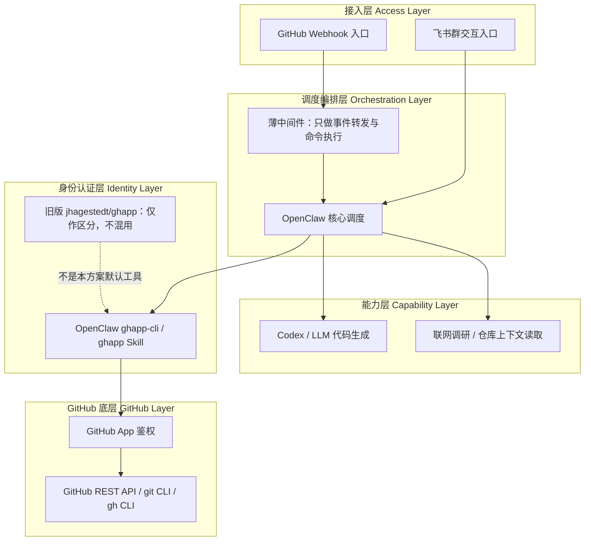
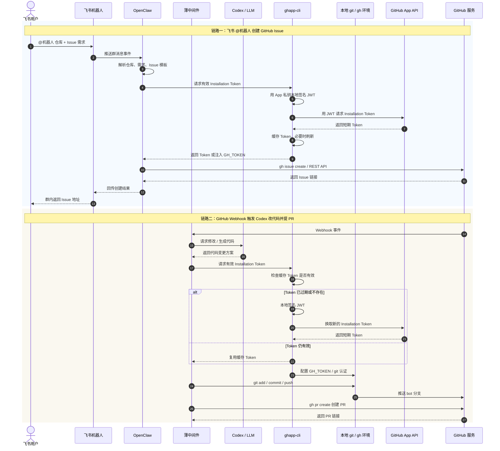
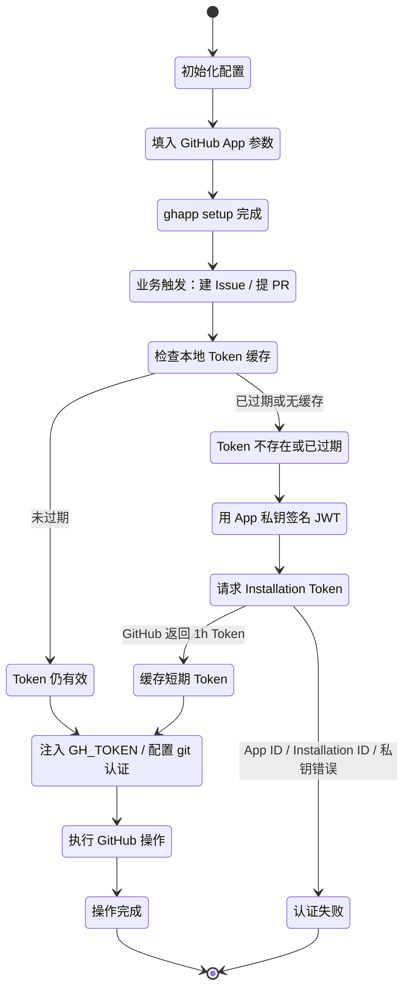
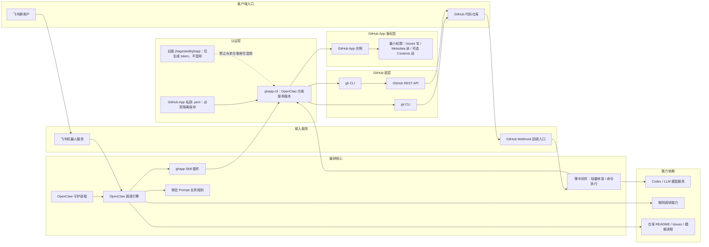

```mermaid
flowchart TB
    %% 分层泳道角色划分：架构职责解耦

    subgraph L1["接入层 Access Layer"]
        feishu["飞书群交互入口"]
        webhook["GitHub Webhook 入口"]
    end

    subgraph L2["调度编排层 Orchestration Layer"]
        openclaw["OpenClaw 核心调度"]
        middleware["薄中间件：只做事件转发与命令执行"]
    end

    subgraph L3["能力层 Capability Layer"]
        codex["Codex / LLM 代码生成"]
        context["联网调研 / 仓库上下文读取"]
    end

    subgraph L4["身份认证层 Identity Layer"]
        ghappNew["OpenClaw ghapp-cli / ghapp Skill"]
        ghappOld["旧版 jhagestedt/ghapp：仅作区分，不混用"]
    end

    subgraph L5["GitHub 底层 GitHub Layer"]
        githubApp["GitHub App 鉴权"]
        githubOps["GitHub REST API / git CLI / gh CLI"]
    end

    feishu --> openclaw
    webhook --> middleware
    middleware --> openclaw
    openclaw --> codex
    openclaw --> context
    openclaw --> ghappNew
    ghappNew --> githubApp
    githubApp --> githubOps

    ghappOld -. "不是本方案默认工具" .-> ghappNew
```

```mermaid
sequenceDiagram
    autonumber

    actor User as 飞书用户
    participant FeishuBot as 飞书机器人
    participant OpenClaw as OpenClaw
    participant Middleware as 薄中间件
    participant Codex as Codex / LLM
    participant Ghapp as ghapp-cli
    participant LocalEnv as 本地 git / gh 环境
    participant GitHubApp as GitHub App API
    participant GitHub as GitHub 服务

    rect rgb(245, 250, 255)
        note over User,GitHub: 链路一：飞书 @机器人 创建 GitHub Issue
        User->>FeishuBot: @机器人 仓库 + Issue 需求
        FeishuBot->>OpenClaw: 推送群消息事件
        OpenClaw->>OpenClaw: 解析仓库、需求、Issue 模板
        OpenClaw->>Ghapp: 请求有效 Installation Token
        Ghapp->>Ghapp: 用 App 私钥本地签名 JWT
        Ghapp->>GitHubApp: 用 JWT 请求 Installation Token
        GitHubApp-->>Ghapp: 返回短期 Token
        Ghapp->>Ghapp: 缓存 Token，必要时刷新
        Ghapp-->>OpenClaw: 返回 Token 或注入 GH_TOKEN
        OpenClaw->>GitHub: gh issue create / REST API
        GitHub-->>OpenClaw: 返回 Issue 链接
        OpenClaw-->>FeishuBot: 回传创建结果
        FeishuBot-->>User: 群内返回 Issue 地址
    end

    rect rgb(250, 248, 240)
        note over User,GitHub: 链路二：GitHub Webhook 触发 Codex 改代码并提 PR
        GitHub->>Middleware: Webhook 事件
        Middleware->>Codex: 请求修改 / 生成代码
        Codex-->>Middleware: 返回代码变更方案
        Middleware->>Ghapp: 请求有效 Installation Token
        Ghapp->>Ghapp: 检查缓存 Token 是否有效
        alt Token 已过期或不存在
            Ghapp->>Ghapp: 本地签名 JWT
            Ghapp->>GitHubApp: 换取新的 Installation Token
            GitHubApp-->>Ghapp: 返回短期 Token
        else Token 仍有效
            Ghapp-->>Middleware: 复用缓存 Token
        end
        Ghapp->>LocalEnv: 配置 GH_TOKEN / git 认证
        Middleware->>LocalEnv: git add / commit / push
        LocalEnv->>GitHub: 推送 bot 分支
        Middleware->>GitHub: gh pr create 创建 PR
        GitHub-->>Middleware: 返回 PR 链接
    end
```

```mermaid
stateDiagram-v2
    [*] --> ConfigStart

    state "初始化配置" as ConfigStart
    state "填入 GitHub App 参数" as FillParams
    state "ghapp setup 完成" as GhappReady
    state "业务触发：建 Issue / 提 PR" as BusinessTrigger
    state "检查本地 Token 缓存" as CheckCache
    state "Token 仍有效" as TokenValid
    state "Token 不存在或已过期" as TokenExpired
    state "用 App 私钥签名 JWT" as SignJWT
    state "请求 Installation Token" as RequestToken
    state "缓存短期 Token" as CacheToken
    state "注入 GH_TOKEN / 配置 git 认证" as InjectAuth
    state "执行 GitHub 操作" as ExecuteGitHub
    state "操作完成" as Done
    state "认证失败" as AuthFailed

    ConfigStart --> FillParams
    FillParams --> GhappReady
    GhappReady --> BusinessTrigger
    BusinessTrigger --> CheckCache

    CheckCache --> TokenValid: 未过期
    CheckCache --> TokenExpired: 已过期或无缓存

    TokenExpired --> SignJWT
    SignJWT --> RequestToken
    RequestToken --> CacheToken: GitHub 返回 1h Token
    RequestToken --> AuthFailed: App ID / Installation ID / 私钥错误

    TokenValid --> InjectAuth
    CacheToken --> InjectAuth
    InjectAuth --> ExecuteGitHub
    ExecuteGitHub --> Done
    Done --> [*]

    AuthFailed --> [*]
```

```mermaid
flowchart LR
    %% 物理部署 + 服务依赖 + 边界隔离 + 最小权限

    subgraph Client["客户端入口"]
        feishuUser["飞书群用户"]
        githubRepo["GitHub 代码仓库"]
    end

    subgraph Ingress["接入服务"]
        feishuBot["飞书机器人服务"]
        webhookEntry["GitHub Webhook 回调入口"]
    end

    subgraph Core["编排核心"]
        openclawDaemon["OpenClaw 守护进程"]
        openclawEngine["OpenClaw 调度引擎"]
        ghappSkill["ghapp Skill 插件"]
        promptRules["常驻 Prompt 业务规则"]
        middleware["薄中间件：轻量转发 / 命令执行"]
    end

    subgraph Capability["能力依赖"]
        codexService["Codex / LLM 模型服务"]
        webResearch["联网调研能力"]
        repoContext["仓库 README / Issues / 模板读取"]
    end

    subgraph Identity["认证层"]
        ghappCli["ghapp-cli：OpenClaw 方案使用版本"]
        oldGhapp["旧版 jhagestedt/ghapp：仅生成 token，不混用"]
        pemSecret["GitHub App 私钥 .pem：必须隔离保存"]
    end

    subgraph Authz["GitHub App 鉴权层"]
        githubApp["GitHub App 实例"]
        minPerm["最小权限：Issues 写 / Metadata 读 / 可选 Contents 读"]
    end

    subgraph GitHubLayer["GitHub 底层"]
        restApi["GitHub REST API"]
        gitCli["git CLI"]
        ghCli["gh CLI"]
    end

    feishuUser --> feishuBot
    githubRepo --> webhookEntry

    feishuBot --> openclawEngine
    webhookEntry --> middleware

    openclawDaemon --> openclawEngine
    openclawEngine --> promptRules
    openclawEngine --> ghappSkill
    openclawEngine --> webResearch
    openclawEngine --> repoContext

    middleware --> codexService
    middleware --> ghappCli

    ghappSkill --> ghappCli
    pemSecret --> ghappCli
    ghappCli --> githubApp
    githubApp --> minPerm

    ghappCli --> ghCli
    ghappCli --> gitCli
    ghCli --> restApi
    gitCli --> githubRepo
    restApi --> githubRepo

    oldGhapp -. "禁止与本方案命令混用" .-> ghappCli
```
