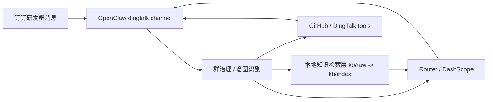
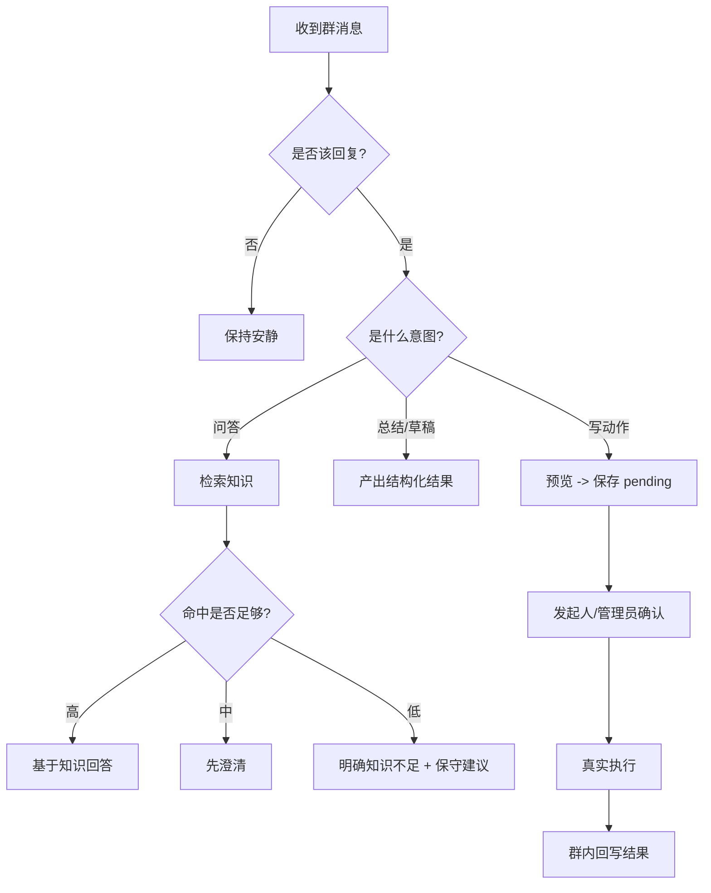

# OpenClaw 钉钉研发群机器人需求描述与落地蓝图（000版）

> 文档目标：让“新开 Codex / 新手同学 / 新接手维护者”只看这一份文档，就能理解 `dd-bot` 的需求主线、边界、知识方案、工具闭环和落地步骤。
>
> 场景边界：**只做单个钉钉研发群的协作机器人**，重点是知识问答、讨论整理、协作草稿和受控写入，不展开电商客服、多角色自治、复杂长期记忆。
>
> 当前推荐主线：`OpenClaw + dingtalk channel + Router / DashScope + 本地知识检索 + GitHub / DingTalk tools`

---

## 1. 先讲结论（教师指挥官版）

你现在要做的不是“先堆技术”，而是先把四件事钉死：

1. **机器人到底替谁做事**
   - 是研发群协作助手，不是万能聊天陪伴 bot
2. **机器人什么能答，什么不能答**
   - 边界比模型能力更重要
3. **知识怎么提供给机器人**
   - 不再把所有文档一股脑塞进 `knowledge/`
   - 要先过“原始文档 -> 本地索引 -> 检索结果”这条链路
4. **不能直接执行的动作怎么闭环**
   - 要有“预览 -> 确认 -> 执行 -> 回写”的受控流程

技术上，我们已经有可用底座：

- `OpenClaw`
- 社区 `dingtalk` channel 插件
- `Router(gpt-5.3-codex)` 主模型
- `DashScope` fallback
- 本地知识检索工具
- GitHub Issue / 钉钉日程工具

这份文档的主线是：

**需求先行，知识与工具都服务于群协作需求。**

---

## 2. 业务上下文（只保留研发群主线）

### 2.1 场景故事（统一口径）

- 你在做的是一个 **钉钉研发群机器人**
- 机器人面对的是：
  - 新人
  - 普通研发成员
  - 导师 / 负责人
  - 机器人维护者
- 核心目标不是“更会聊”，而是：
  - 更稳定地回答项目问题
  - 更少打扰地辅助群协作
  - 更可控地推进 issue / 日程 / wiki 这类动作

### 2.2 业务痛点（为什么要做）

- 新人不断重复问环境、流程、权限、文档入口
- 群里讨论很多，但没有结构化总结
- 明明应该提 issue / 约会 / 沉淀 wiki，却因为麻烦被搁置
- 机器人如果没有知识约束，很容易“看起来聪明，实际上乱答”
- 缺知识时如果没有统一兜底，会让维护者被动救火

### 2.3 本期（P0 / P1）定义

当前阶段不是“全自动群 PM”，而是：

- **P0**
  - 能稳定接收指定研发群消息
  - 在知识范围内回答问题
  - 不会答时明确说明知识不足
  - 能生成总结 / Issue 草稿 / Wiki 草稿 / 日程预览
  - GitHub / 钉钉日程写入必须确认
- **P1**
  - 建成本地知识抽象接口
  - 建立 `kb/raw -> kb/index -> search/get` 链路
  - 让知识检索与群策略成为 OpenClaw 的标准调用步骤

---

## 3. 需求总览（主线）

### 3.1 目标用户画像

### A. 新人

- 关心：环境怎么配、项目怎么跑、文档在哪、权限怎么申请
- 行为：高频重复问基础问题
- 诉求：答案要明确、短、能执行

### B. 普通研发成员

- 关心：问题怎么定位、结论怎么整理、是否要提 issue、是否要约会
- 行为：讨论多、信息碎、经常半结构化表达
- 诉求：机器人帮忙整理，而不是抢话

### C. 导师 / 负责人

- 关心：哪些问题已经有明确答案，哪些需要人工拍板
- 行为：只想在关键节点介入
- 诉求：需要闭环，不希望机器人胡乱承诺

### D. 维护者

- 关心：知识怎么提供、工具怎么接、规则怎么控
- 行为：持续修知识、修提示词、修工具
- 诉求：结构清晰、可替换、可验证

### 3.2 功能需求（P0 必须）

1. **群问答**
   - 环境 / 流程 / FAQ / 文档导航问题优先依据知识库回答
2. **知识不足兜底**
   - 当前知识库没有可靠依据时，必须明确说出来
   - 可以给一个保守、简短、非拍板式的 LLM 回复
3. **群聊总结**
   - 输出结论、背景、关键结论、待办、风险、来源
4. **Issue 草稿**
   - 识别问题是否应落成 issue
   - 生成带仓库建议的结构化草稿
5. **Wiki 草稿**
   - 识别讨论是否值得沉淀
   - 生成带空间 / 分类建议的草稿
6. **日程辅助**
   - 识别会议意图
   - 生成预览
   - 确认后创建钉钉日程
7. **写入闭环**
   - 真实写 GitHub / 钉钉前，先预览，再确认，再执行
8. **结果回写**
   - 执行成功后，在当前群回写结果
9. **知识缺口闭环**
   - 知识不足时记录待补知识项
10. **审计可追溯**
   - 问答、知识命中、pending、确认、执行都应记录事件

### 3.3 非目标（本期不做）

- 不做全群自动陪聊
- 不做复杂多机器人自治
- 不做未经审核的群聊自动入知识库
- 不做无确认的高风险外部写入
- 不做公司 Wiki 真发布闭环（当前仍未接入）

---

## 4. 对话规则（这是成败核心）

### 4.1 “能答 / 不能答”判定矩阵

| 类型 | 示例 | 动作 |
|---|---|---|
| 标准已知问题 | “新人开发环境怎么配置？” | 直接基于知识回答 |
| 已知但缺参数 | “帮我建个会” | 先补主题 / 时间等关键字段 |
| 知识不足 | “这个新接口要不要走另一个审批链？” | 明确说知识不足，再给保守建议 |
| 高风险结论 | “这个生产权限你帮我直接开一下” | 不执行，转人工 |
| 明确写动作 | “提个 issue”“创建日程” | 先草稿 / 预览，再走确认闭环 |
| 无关闲聊 | “收到”“哈哈哈”“我看下” | 保持安静或极短回复 |

### 4.2 回复策略（强约束）

- 先判断是否需要回复，再决定怎么回复
- 问答优先“知识命中结果”，不是直接放模型自由发挥
- 知识不足时，必须明确区分：
  - **项目事实**
  - **保守建议**
- 群里默认简洁，少打扰
- 涉及政策、生产权限、责任归属、敏感数据时，不给拍板式结论

### 4.3 统一知识不足输出

当当前知识库没有可靠依据时，统一策略至少包含：

```text
我没在当前知识库里找到这部分的可靠依据。
如果只给保守建议，我建议先确认 X / Y / Z，再由负责人拍板。
如果你愿意，我可以先帮你整理成待确认清单 / Wiki 草稿 / Issue 草稿。
```

### 4.4 升级给人工（闭环格式）

升级消息至少包含：

- 群 / 会话标识
- 原问题原文
- 当前知识为什么不足
- 还缺什么信息
- 建议下一步动作

---

## 5. 业务信息模型（机器人“脑子里”的表）

### 5.1 知识文档最小字段

| 字段 | 说明 |
|---|---|
| `doc_id` | 文档唯一标识 |
| `title` | 文档标题 |
| `project` | 所属项目 |
| `owner` | 文档负责人 |
| `updated_at` | 最近更新时间 |
| `review_status` | 是否已审核 |
| `tags` | 主题标签 |
| `applicable_roles` | 适用角色 |
| `relative_path` | 原始文档路径 |

### 5.2 协作动作最小字段

| 类型 | 必备字段 |
|---|---|
| Issue | `title` `owner/repo` `body` |
| Wiki 草稿 | `title` `space` `body` |
| 日程 | `summary` `start` `end` |
| Pending Action | `kind` `headline` `requester` `params` |

### 5.3 群策略最小字段

| 字段 | 说明 |
|---|---|
| `allowedConversationIds` | 哪些群允许机器人响应 |
| `admins` | 哪些人可做管理员确认 |
| `routing.githubRepos` | 群 / 关键词到仓库映射 |
| `routing.wikiSpaces` | 关键词到 Wiki 空间映射 |
| `autoReply` | 自动回复触发规则 |
| `safety` | 高风险与确认策略 |

---

## 6. 知识架构（本地方案）

### 6.1 为什么不能再把所有文档塞进 `knowledge/`

因为这样会带来 4 个问题：

1. 文档越多，模型上下文越混乱
2. 规则文档和业务文档混在一起，权重不清
3. 无法稳定做“命中 / 未命中”判断
4. 很难平滑升级到真正的 RAG / 中台

### 6.2 当前推荐分层

```text
docs_source/              # 仓库内作者目录
  -> sync_openclaw_workspace.sh
workspace/kb/raw/         # 原始知识文档
workspace/kb/index/       # 本地索引
workspace/knowledge/      # 少量规则、模板、边界说明
```

### 6.3 检索接口（必须抽象）

统一抽象为：

- `buildIndex()`
- `searchKnowledge(query, topic, filters)`
- `getSourceChunks(ids)`
- `getDocMeta(docId)`

这样以后无论底层是：

- 本地 JSON 索引
- SQLite / sqlite-vec
- `yeying-rag`

上层 OpenClaw 的调用方式都不需要大改。

### 6.4 当前本地工具落点

- `tools/knowledge_index.mjs`
  - 构建 / 查看索引状态
- `tools/knowledge_search.mjs`
  - 检索命中 chunk
- `tools/knowledge_get.mjs`
  - 读取命中 chunk / doc
- `tools/knowledge_gap.mjs`
  - 记录 / 查看 / 关闭待补知识项
- `tools/audit_log.mjs`
  - 查看审计日志

---

## 7. 全局架构图（需求驱动）





---

## 8. 开发目录规范（本项目版本）

### 8.1 当前主目录

```text
example/example_dd/
├── README.md
├── docs/
│   ├── OpenClaw_000_need.md
│   ├── product-overview.md
│   ├── prd.md
│   ├── architecture.md
│   ├── workflows.md
│   ├── kb-and-rag.md
│   └── roadmap.md
├── docs_source/
│   ├── facts/
│   ├── policies/
│   ├── playbooks/
│   ├── templates/
│   ├── examples/
│   ├── INDEX.md
│   └── knowledge_manifest.{yaml,json}
├── kb/
│   └── README.md
├── config/
├── scripts/
└── workspace_assets/
```

### 8.2 OpenClaw workspace 运行态目录

```text
~/.openclaw/workspace-dd-bot/
├── AGENTS.md
├── TOOLS.md
├── knowledge/
├── kb/
│   ├── raw/
│   └── index/
├── policy/
├── hooks/
├── skills/
└── tools/
```

---

## 9. 脚本职责设计（先定“做什么”，再写代码）

> 这一节是“脚本契约”，先把每个脚本负责什么定义清楚。

### `scripts/configure_openclaw_dingtalk.sh`

- 配置 OpenClaw
- 安装 / 启用 dingtalk 插件
- 写入 Router / DashScope 模型配置
- 启用 confirmation hook

### `scripts/sync_openclaw_workspace.sh`

- 同步 skills / hooks / tools
- 同步 `policy/runtime-policy.json`
- 同步 `docs_source/` 到 `kb/raw/`
- 同步少量指导性文档到 `knowledge/`
- 构建 `kb/index/knowledge-index.json`

### `scripts/run_openclaw_gateway.sh`

- 载入 `.env.local`
- 启动 `openclaw gateway run`

### `scripts/verify_openclaw_grounding.sh`

- 验证问答是否会引用知识来源
- 验证来源是否走 `kb/raw/...`

### `scripts/verify_openclaw_tool_previews.sh`

- 验证本地索引状态
- 验证检索 / chunk 拉取
- 验证 Issue / 日程预览

### `scripts/verify_openclaw_group_scenarios.sh`

- 验证已知问答命中
- 验证未知问答进入知识缺口队列
- 验证高风险消息转人工
- 验证日程缺字段时先澄清
- 验证审计日志可追溯

### `scripts/verify_confirmation_bridge_hook.sh`

- 验证草稿转 pending
- 验证发起人 / 管理员确认
- 验证取消执行

---

## 10. 新手上手作战手册（命令级）

### 10.1 第 0 步：进入目录

```bash
cd /home/shengfeng/bot/example/example_dd
```

### 10.2 第 1 步：准备本地配置

```bash
cp config/env.example .env.local
```

如需自定义策略：

```bash
# 可选
echo 'DD_POLICY_PATH=config/policy.example.json' >> .env.local
```

### 10.3 第 2 步：配置 OpenClaw 与钉钉

```bash
bash scripts/configure_openclaw_dingtalk.sh
```

### 10.4 第 3 步：同步 workspace 与索引

```bash
bash scripts/sync_openclaw_workspace.sh
node ~/.openclaw/workspace-dd-bot/tools/knowledge_index.mjs --action status
```

### 10.5 第 4 步：启动 Gateway

```bash
bash scripts/run_openclaw_gateway.sh
```

### 10.6 第 5 步：做本地检索 smoke test

```bash
node ~/.openclaw/workspace-dd-bot/tools/knowledge_search.mjs --query "新人开发环境怎么配置"
```

如需展开命中内容：

```bash
node ~/.openclaw/workspace-dd-bot/tools/knowledge_get.mjs --ids "<chunkId>"
```

### 10.7 第 6 步：做工具与闭环验证

```bash
bash scripts/verify_openclaw_tool_previews.sh
bash scripts/verify_confirmation_bridge_hook.sh
bash scripts/verify_openclaw_confirmation_loop.sh
```

---

## 11. 验收标准（按业务，不按想象）

### 11.1 知识问答验收

- 问环境问题，能基于 `kb/raw` 命中文档回答
- 回答中能带来源
- 知识不足时不会硬编

### 11.2 群协作验收

- “帮我总结一下”时能输出结构化总结
- “提个 issue”时能产出带仓库建议的草稿
- “整理成 wiki”时能产出带空间建议的草稿

### 11.3 写动作验收

- “创建日程 / 创建 issue”时不会直接写入
- 会先预览并保存 pending
- 只有发起人或管理员可确认 / 取消
- 成功后群里能看到结果回写

### 11.4 知识架构验收

- 原始知识文档不再全量塞进 `knowledge/`
- `kb/raw` 与 `kb/index` 分层清晰
- 检索接口可独立替换，未来可切到 `yeying-rag`

### 11.5 知识缺口与审计验收

- 知识不足时能记录待补知识项
- 相同问题重复出现时不会无限新增重复缺口
- `message_intake`、pending、确认执行、确认拒绝都有审计事件

---

## 12. 下一阶段怎么演进

当前这份 000 文档解决的是：

- 机器人是谁
- 机器人能做什么
- 知识怎么喂
- 工具怎么闭环

下一阶段再继续做：

1. **统一审计日志**
2. **待补知识 / 待人工确认队列**
3. **Wiki 真发布链路**
4. **是否接 `yeying-rag`**

一句话记住：

**OpenClaw 是智能使用者，不是知识库本体。**
