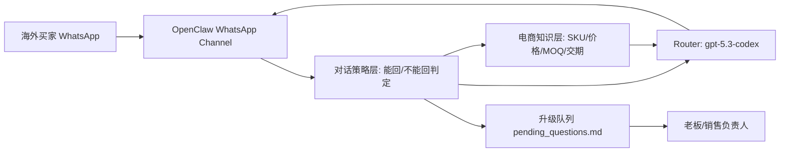
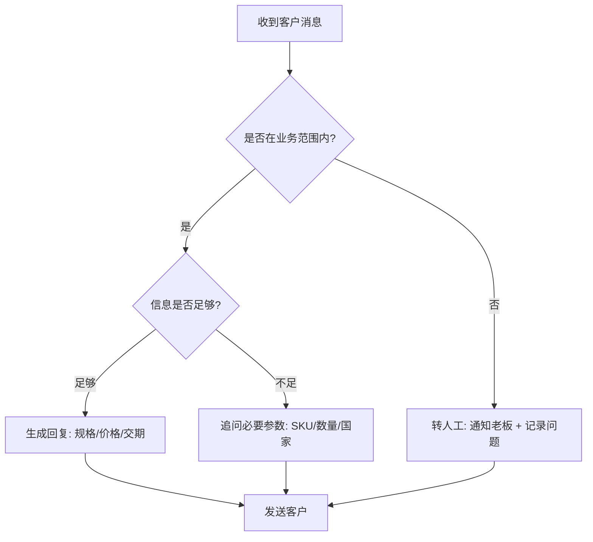
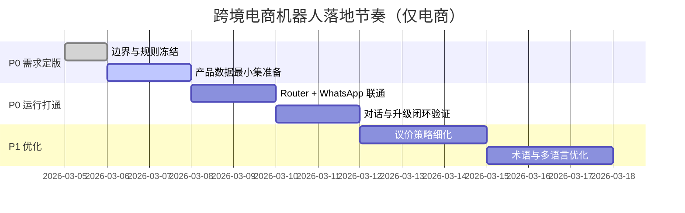

# OpenClaw 跨境电商场景需求描述与落地蓝图（000版）

> 文档目标：让“新开 Codex / 新手同学”只看这一份文档，就能理解需求主线，并按步骤把跨境电商聊天机器人跑起来。  
> 场景边界：**只做跨境电商（玩具）买卖对话**，不展开钉钉机器人、社区多角色自治等其他方向。  
> 文档路径：`/home/snw/SnwHist/FirstExample/OpenClaw_000_need.md`

---

## 1. 先讲结论（教师指挥官版）

你现在要做的不是“先堆技术”，而是先把三件事钉死：

1. **机器人到底替谁说话**（卖家助理，不是万能客服）
2. **机器人什么能回，什么不能回**（边界比模型更重要）
3. **不能回时怎么升级给老板**（要有闭环，不要沉默失败）

技术上，我们已经有可用底座：`OpenClaw + WhatsApp + Router(gpt-5.3-codex)`。  
这次文档的主线是：**需求先行，方案服务需求**。

---

## 2. 业务上下文（只保留电商主线）

### 2.1 场景故事（统一口径）

- 你是国内玩具厂商侧的“销售助理机器人”
- 沟通渠道主要在 WhatsApp（群聊 + 私聊）
- 对话对象是国外代理商/采购商（例如法国客户）
- 核心目标是：**快速、专业、稳定地完成询盘到报价推进**

### 2.2 业务痛点（为什么要做）

- 人工客服不能 7x24 在线
- 同类问题反复出现（价格、MOQ、交期、物流、认证）
- 报价口径不统一，容易前后矛盾
- 无法回答的问题没有系统化沉淀，老板经常“被动救火”

### 2.3 本期（P0）定义

P0 不是“全自动成交”，而是：

- 能稳定接收并理解询盘
- 在知识范围内给出合规回复
- 超出范围时明确升级给老板并记录
- 可持续迭代（每次补充资料后，机器人更懂业务）

---

## 3. 需求总览（主线）

### 3.1 目标用户画像

### A. 买家（海外采购）

- 关心：价格、起订量、交期、运费、认证
- 语言：英语/简单法语，偏短句
- 行为：先压价，再问样品，再问大货条件

### B. 卖家运营（你方）

- 关心：询盘是否有效、毛利是否可控、响应是否及时
- 行为：需要机器人先筛选问题、先给标准答案

### C. 老板/主管

- 关心：成交线索、风险询盘、需要拍板的问题
- 行为：只希望看到“该我处理的关键问题”，不希望被噪音淹没

### 3.2 功能需求（P0 必须）

1. **询盘接待**：买家打招呼/询价，机器人能给专业开场
2. **产品答疑**：能回答规格、材质、适龄、包装、认证等标准问题
3. **报价输出**：根据 SKU + 数量区间输出价格范围（明确币种）
4. **议价应对**：支持“便宜一点”“量大优惠”等常见话术
5. **边界拦截**：超出知识范围时不胡编，转人工
6. **升级闭环**：把“不能回的问题”记录到待处理清单并通知老板
7. **会话记录**：保留关键上下文，避免同一会话前后矛盾

### 3.3 非目标（本期不做）

- 不做钉钉消息收集与自动提 Issue/Wiki 全流程
- 不做多角色自治（产品/开发/测试机器人互相协作）
- 不做复杂 CRM 深度集成

---

## 4. 对话规则（这是成败核心）

### 4.1 “能回 / 不能回”判定矩阵

| 类型 | 示例 | 动作 |
|---|---|---|
| 标准已知问题 | “这款玩具 MOQ 是多少？” | 直接回复 |
| 已知但缺参数 | “多少钱？”（没说 SKU/数量） | 先追问必要参数 |
| 超出资料范围 | “你们能做法国本地售后协议吗？” | 触发升级，不胡编 |
| 高风险承诺 | “保证清关失败全额赔吗？” | 不承诺，转老板拍板 |
| 无关闲聊/骚扰 | 纯无效内容 | 礼貌收束，必要时忽略 |

### 4.2 回复策略（强约束）

- 先确认需求，再给答案（避免答非所问）
- 优先短句，少术语，面向买家可读性
- 金额必须带币种（USD/EUR），避免歧义
- 任何“政策/法律/赔付承诺”不自动拍板
- 不能回时必须输出统一格式：

```text
这个问题需要我们销售负责人确认，我已帮你转交，稍后给你准确答复。
```

### 4.3 升级给老板（闭环格式）

升级消息至少包含：

- 客户标识（昵称/群名/来源）
- 原问题原文
- 当前缺失信息
- 建议选项（供老板快速决策）

---

## 5. 业务信息模型（机器人“脑子里”的表）

### 5.1 产品主数据（最小必备字段）

| 字段 | 说明 |
|---|---|
| sku | 产品编号（唯一） |
| name | 产品名称 |
| category | 类目（益智/遥控/毛绒等） |
| age_range | 适龄范围 |
| material | 材质 |
| package | 包装规格 |
| cert | 认证（CE/EN71/ASTM 等） |
| moq | 起订量 |
| lead_time_days | 交期（天） |
| price_tier | 阶梯价格（按数量） |
| sample_policy | 样品政策 |
| shipping_terms | 物流条款（EXW/FOB/CIF） |
| updated_at | 最近更新时间 |

### 5.2 报价规则（P0 可执行）

- 有 SKU + 数量：给对应阶梯价
- 无数量：给区间价，并追问数量
- 议价：最多给“可谈范围”，不直接突破底价
- 不确定：升级老板，不臆造价格

---

## 6. 全局架构图（需求驱动）





---

## 7. 开发绝对路径与目录规范（可直接照抄）

### 7.1 路径约定（本次统一）

### 本地文档机（Linux）

- 需求文档目录：`/home/snw/SnwHist/FirstExample`
- 本文档路径：`/home/snw/SnwHist/FirstExample/OpenClaw_000_need.md`

### 运行机（Windows + WSL，经 `cnwin-admin-via-vps`）

- 目标仓库根目录：`/home/administrator/bot`
- 运行数据目录：`/home/administrator/bot/runtime`
- 脚本目录：`/home/administrator/bot/scripts`
- 业务资料目录：`/home/administrator/bot/data/ecom`
- 提示词目录：`/home/administrator/bot/prompts`

### 7.2 建议目录树（P0）

```text
/home/administrator/bot
├── README.md
├── docs/
│   ├── requirement/
│   │   └── OpenClaw_000_need.md
│   └── runbook/
├── prompts/
│   └── ecom_system_prompt.md
├── data/
│   └── ecom/
│       ├── products.csv
│       ├── faq.md
│       └── pricing_rules.md
├── scripts/
│   ├── 00_check_host.sh
│   ├── 01_check_network.sh
│   ├── 02_config_router.sh
│   ├── 03_login_whatsapp.sh
│   ├── 04_start_gateway.sh
│   ├── 05_smoke_test.sh
│   └── 06_collect_escalation.sh
└── runtime/
    ├── logs/
    └── escalation/
        └── pending_questions.md
```

---

## 8. 脚本职责设计（先定“做什么”，再写代码）

> 注意：这一节是**脚本契约**，先把每个脚本责任定义清楚，避免“写了一堆脚本但没人知道谁负责什么”。

### `scripts/00_check_host.sh`

- 验证你连的是目标主机，不是串机
- 输出 `hostname`、`whoami`、`wsl` 信息

### `scripts/01_check_network.sh`

- 检查 v2rayN 代理链路是否可用
- 检查 WSL DNS 是否正常解析
- 输出是否能访问 Router 域名

### `scripts/02_config_router.sh`

- 写入 OpenClaw Router 配置
- 设置默认模型为 `router/gpt-5.3-codex`
- 做一次 `/v1/models` 健康探测

### `scripts/03_login_whatsapp.sh`

- 启用 WhatsApp 插件
- 执行扫码登录
- 打印 `openclaw channels status`

### `scripts/04_start_gateway.sh`

- 用 `openclaw gateway run` 前台或 `nohup` 后台启动
- 日志输出到 `runtime/logs/gateway.log`

### `scripts/05_smoke_test.sh`

- 检查 Router 调用
- 检查渠道连接状态
- 给出“可接客 / 不可接客”结论

### `scripts/06_collect_escalation.sh`

- 将不能回答的问题追加到：
  - `runtime/escalation/pending_questions.md`
- 统一格式（时间、客户、问题、建议动作）

---

## 9. 新手上手作战手册（命令级，按部就班）

### 9.1 第 0 步：连对机器（先排最大坑）

在本地终端执行：

```bash
ssh cnwin-admin-via-vps "hostname"
ssh cnwin-admin-via-vps "wsl -e bash -lc 'whoami && hostname && pwd'"
```

验收标准：

- 能看到预期 Windows 主机名
- WSL 用户通常为 `administrator`

### 9.2 第 1 步：准备运行目录

```bash
ssh cnwin-admin-via-vps "wsl -e bash -lc 'mkdir -p /home/administrator/bot/{docs/requirement,docs/runbook,prompts,data/ecom,scripts,runtime/logs,runtime/escalation}'"
ssh cnwin-admin-via-vps "wsl -e bash -lc 'touch /home/administrator/bot/runtime/escalation/pending_questions.md && ls -la /home/administrator/bot'"
```

### 9.3 第 2 步：网络链路检查（电商机器人可用前提）

### Windows 管理员 PowerShell（在运行机执行）

```powershell
netsh interface portproxy show all
netsh interface portproxy delete v4tov4 listenaddress=0.0.0.0 listenport=10810
netsh interface portproxy add v4tov4 listenaddress=0.0.0.0 listenport=10810 connectaddress=127.0.0.1 connectport=10808
netsh interface portproxy show all
```

### WSL 内验证

```bash
cat /etc/resolv.conf
curl -sS https://test-router.yeying.pub/v1/models -o /tmp/models.json -w "%{http_code}\n"
```

如果解析异常，执行（WSL）：

```bash
sudo rm -f /etc/resolv.conf
echo "nameserver 8.8.8.8" | sudo tee /etc/resolv.conf
```

### 9.4 第 3 步：安装与配置 OpenClaw（如已安装可跳过）

```bash
# WSL
node -v
npm -v
npm i -g openclaw
openclaw --version
```

配置 Router（WSL）：

```bash
openclaw config set models.providers.router.baseUrl "https://test-router.yeying.pub/v1"
openclaw config set models.providers.router.auth "api-key"
openclaw config set models.providers.router.apiKey "<你的ROUTER_API_KEY>"
openclaw config set models.providers.router.api "openai-responses"
openclaw config set models.providers.router.models '[{"id":"gpt-5.3-codex","name":"GPT-5.3-Codex"}]'
openclaw config set agents.defaults.model.primary "router/gpt-5.3-codex"
```

### 9.5 第 4 步：接入 WhatsApp

```bash
openclaw plugins enable whatsapp
openclaw channels add --channel whatsapp
openclaw channels login --channel whatsapp --verbose
openclaw channels status
```

> 经验提醒：终端显示 `Linked` 不等于“长期稳定在线”。必须再看 `channels status` 和实际收发测试。

### 9.6 第 5 步：写入电商知识素材（先最小可用）

创建产品样例（WSL）：

```bash
cat >/home/administrator/bot/data/ecom/products.csv <<'EOF'
sku,name,moq,lead_time_days,price_tier_usd,cert,shipping_terms,updated_at
TOY-001,Magnetic Blocks 64pcs,200,15,"200-499:4.20|500-999:3.85|1000+:3.55","CE;EN71","FOB Shenzhen",2026-03-01
TOY-002,RC Car Basic,100,20,"100-299:8.90|300-799:8.10|800+:7.40","CE;EN71;RoHS","FOB Shenzhen",2026-03-01
EOF
```

创建提示词草稿（WSL）：

```bash
cat >/home/administrator/bot/prompts/ecom_system_prompt.md <<'EOF'
你是中国玩具厂商的跨境销售助理。
目标：快速、专业、诚实地回复海外买家询盘。
规则：
1) 仅在资料范围内回答，不确定就明确转人工；
2) 回答价格必须带币种；
3) 涉及赔付、法律承诺、特殊条款时必须转老板确认；
4) 优先短句，语气礼貌，先问清SKU/数量/目标国家再报价；
5) 若无法回答，使用固定句式：该问题已转交销售负责人确认。
EOF
```

### 9.7 第 6 步：设置群聊策略并启动

```bash
openclaw config set channels.whatsapp.groupPolicy open
openclaw config set channels.whatsapp.accounts.default.groupPolicy open
openclaw config set messages.groupChat.mentionPatterns '[".*"]'
openclaw config set messages.groupChat.historyLimit 30
```

启动网关（WSL）：

```bash
nohup openclaw gateway run >/home/administrator/bot/runtime/logs/gateway.log 2>&1 &
sleep 2
ps -ef | grep -i openclaw-gateway | grep -v grep
```

---

## 10. 验收标准（只看电商目标）

### 10.1 功能验收

- 买家问“有没有 TOY-001，500件多少钱？” -> 能给阶梯价
- 买家问“能再便宜一点吗？” -> 能给议价范围并引导数量
- 买家问“保证法国清关失败赔付吗？” -> 明确转人工
- 不能回的问题会写入 `pending_questions.md`

### 10.2 质量验收

- 回答不胡编
- 金额带币种
- 同一会话口径一致
- 30 分钟内连续消息不崩溃、不掉链

### 10.3 业务验收

- 询盘平均首响时间显著下降
- 老板接到的是“关键问题清单”，不是杂乱原始聊天

---

## 11. 经验与踩坑（给未来的新手）

### 11.1 最容易犯的 5 个错

1. 先改技术，不先定“能回/不能回”边界  
2. 路由连通了，就以为渠道稳定了  
3. 只看 `Linked`，不做真实收发验证  
4. 价格没有版本时间，导致答复前后矛盾  
5. 没有升级闭环，老板永远最后被动知道问题  

### 11.2 这次最有价值的经验

- **需求边界 > 模型能力**：边界清晰，模型才稳定
- **网络先于业务**：代理链不稳，电商体验一定崩
- **固定升级格式**：能把“不会答”变成组织资产
- **从一个场景打穿**：先把“玩具询价”做透，再扩场景

---

## 12. 里程碑路线图（MVP -> 可运营）



---

## 13. 你现在就可以执行的最小动作（今天版）

如果你今天只能做一件事，就做这个：

1. 在 `products.csv` 写 2 个真实 SKU  
2. 再用真实询盘问题跑 5 条对话  
3. 把不能回答的问题沉淀到 `pending_questions.md`  

做到这一步，项目就已经从“想法”进入“可运营迭代”。

---

## 14. 收官：这份文档的定位

这不是“炫技文档”，而是“作战说明书”：

- 你拿它可以对齐老板、运营、开发的认知
- 新同学可以直接照着路径和命令起步
- 项目可以围绕同一个需求主线持续迭代

一句话：**先把跨境电商询盘这一个点打穿，再扩张版图。**
